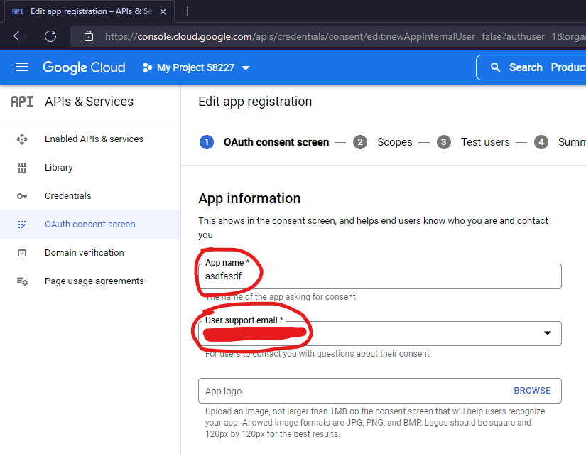
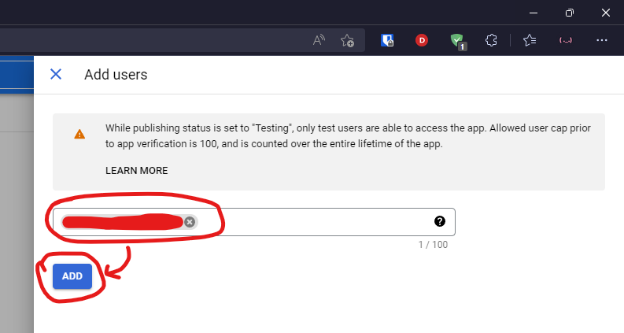

# Getting OAuth Client ID from Google

## Create a project

Go to https://console.cloud.google.com/ and create a project

And then select the project

## Enable Youtube data API

Open menu and then go to "APIs and services" > "Enabled APIs & services"

Click on "Enable APIs & services"

Search for Youtube and click on "Youtube Data API v3"

Enable it!

## Create OAuth consent screen

Click on "OAuth consent screen" (left menu)

Choose "External" and create

Enter your app name, user support email and developer contact infomation and then click on "Save and continue"

> NOTE 1: Needed to fill in

> NOTE 2: You can use your own email

And then click on "Add or remove scopes"

Search for youtube and select "Youtube Data API v3" with ".../auth/youtube" scope, click "Update" and then "Save and continue"

Add test user (your youtube/google account email), click "Update" and then "Save and continue"

Done! Click on "Back to dashboard" to go back

## Generate OAuth client ID and client secret

Click on "Credentials" (left menu)

Click on "Create credentials" (top menu) and then click on OAuth client ID

Select "Web application", name it, click on "Add URI" and enter this URI `http://localhost/oauth2callback` and then create

Done! Download the JSON file

Rename it to `client_secret.json` and put it to your project folder

