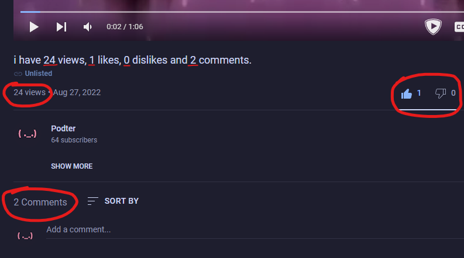
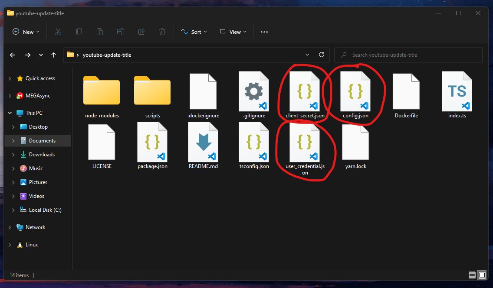

# youtube-update-title

Updates youtube title to match with views count and others


## Usage

Make sure you have Node.js installed (LTS is recommended)

Clone or download this repository and install dependencies

```bash
git clone https://github.com/Podter/youtube-update-title.git
cd youtube-update-title
npm install
```

Download and rename the OAuth Client ID JSON file to `client_secret.json` and put in the folder (you can see how to do it [here](GETOAUTH.md))

Rename `config_example.json` to `config.json` and put your video id there

```json
{
  "id": "dQw4w9WgXcQ"
}
```

Now let's login and generate access token `user_credential.json`

```bash
npm run auth
```

You should get something like this


Open in browser and select your account

And it's time to do some testing (optional)

```bash
npm run getvideo # Get video info
npm run update1 # Update title to "hello world!"
npm run update2 # Update title to "i have ... views"
```

Time to modify some codes (optional)

```typescript
// index.ts at line 43
newVideoTitle = `i have ${views} views, ${likes} likes, ${dislikes} dislikes and ${comments} comments.`; // change video title here
```

Finally, build and run the code

```bash
npm run build
npm start
```

## Revoke (logout)

Just run this and app can't access to your account anymore

```bash
npm run revoke
```

## Docker

Follow [these steps above](#usage) and then build the docker image

```bash
npm run build:docker
# or
docker build -t youtube-update-title .
```

and then run it

```bash
npm run start:docker
# or
docker run -d --name youtube-update-title --restart unless-stopped youtube-update-title
```

You don't need to do anything else because configs (.json files) already built into the image

> Note: You have to rebuild image everytime when token is expired or you just make some changes

## Important!!

Never push this repository or built Docker image with `client_secret.json`, `user_credential.json` or you will expose your account credential! (if someone have those files, they can do anything with your youtube account! like change your channel name or delete some videos)

If you accdient did it, immediately [revoke](#revoke) the credential and regenerate OAuth Client ID JSON file!
